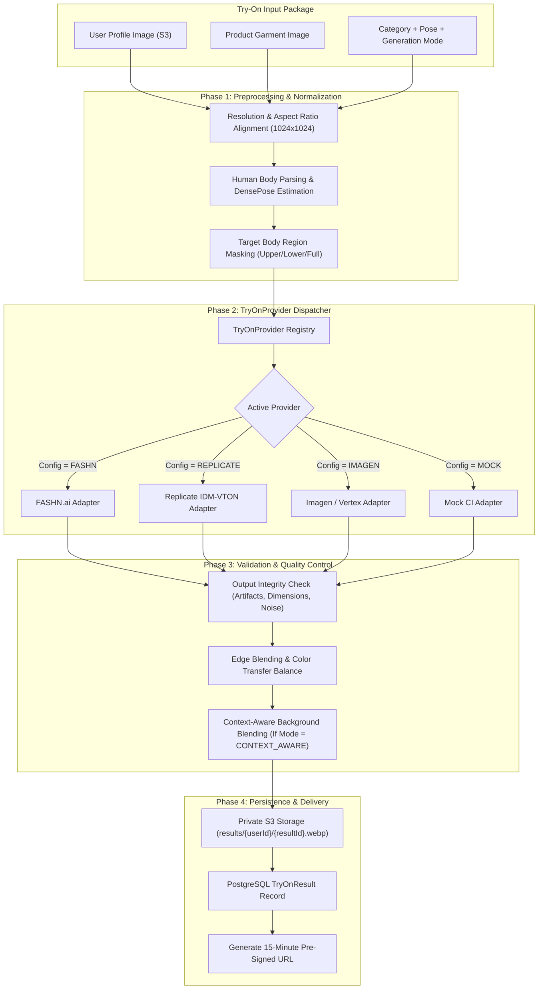

# AI Virtual Try-On Pipeline & Provider Abstraction

**Document Version:** 1.0.0  
**Status:** Approved Architecture Baseline  
**Classification:** Core AI Architecture Specification  

---

## 1. Architectural Strategy & Provider Decoupling

The AI Virtual Try-On system strictly avoids coupling application logic to any single vendor's API. In adherence to Assignment Section 7, 8, 9, 13 & 14, all generation workflows execute through a standardized, pluggable abstraction: the **`TryOnProvider`** interface.

### Architectural Guarantees
1. **Replaceable Backends:** Switch seamlessly between specialized fashion diffusion APIs (e.g. FASHN.ai, Replicate IDM-VTON), generative foundation models (Vertex AI / Imagen 3), or self-hosted diffusion pipelines via configuration without modifying application business logic.
2. **Deterministic Mocking:** A high-fidelity `MockTryOnProvider` is included for local unit testing, CI pipelines, and environments without active cloud credentials.
3. **Server-Side Credentials:** All AI API tokens, secrets, and private keys remain strictly on the backend server. No API keys are ever compiled into or exposed through the Chrome extension.

---

## 2. AI Try-On Pipeline Flow Diagram



---

## 3. Pluggable `TryOnProvider` Interface

```typescript
export interface TryOnInput {
  jobId: string;
  userId: string;
  profileImageUrl: string;
  garmentImageUrl: string;
  category: ProductCategory;
  generationMode: GenerationMode;
  contextEnvironment?: string; // e.g. "outdoor beach", "urban street", "studio neutral"
  seed?: number;
}

export interface TryOnOutput {
  outputImageBuffer: Buffer;
  mimeType: 'image/webp' | 'image/png';
  width: number;
  height: number;
  latencyMs: number;
  providerMetadata: Record<string, any>;
}

export interface TryOnProvider {
  readonly providerId: string;
  readonly isHealthy: () => Promise<boolean>;
  generateTryOn: (input: TryOnInput) => Promise<TryOnOutput>;
}
```

---

## 4. Virtual Try-On Quality & Accuracy Guarantees

In accordance with Assignment Section 7, 8, and 9:

### 4.1 Preserving User Identity
- **Face & Hair Protection:** The pipeline automatically identifies facial and hair landmarks and generates an immutable protection mask. The AI inpainting model is strictly constrained from altering facial structure, eye color, expression, hair texture, or skin undertones.
- **Body Proportion Fidelity:** The system prevents synthetic reshaping of the user's natural body proportions. Garments must drape naturally according to the user's physical posture rather than morphing the user to match a model.

### 4.2 Preserving Product Accuracy
- **Color Accuracy:** High-frequency color histogram comparison ensures the garment color in the synthesized output matches the source product within $\Delta E \le 3.0$ color tolerance.
- **Pattern & Print Retention:** For patterned garments (stripes, florals, typography, brand logos), the generative model utilizes structural ControlNet / IP-Adapter conditioning to anchor logos and prints in their proper spatial coordinates, avoiding hallucinated textures.
- **Garment Silhouette & Details:** Collars, buttons, pockets, hemlines, and seamlines are preserved as visible in the original product photograph.

### 4.3 Context-Aware Visualization (Assignment §8)
- When the `CONTEXT_AWARE` mode is selected, the system detects product context (e.g. swimwear $\rightarrow$ coastal setting, formal suit $\rightarrow$ architectural interior, outerwear $\rightarrow$ outdoor autumn park) and synthesizes realistic lighting, matching ambient color temperature and subtle shadow casting without compromising user identity.

---

## 5. Generation Modes & Profiles

| Mode | Target Latency | Optimization Focus | Model Parameters |
|---|---|---|---|
| **FAST** | $3 - 5\text{ seconds}$ | Immediate feedback, quick browsing | Lower inference steps (20 steps), standard resolution ($768\times 768$), simplified inpainting mask. |
| **STANDARD** | $8 - 12\text{ seconds}$ | Balanced fidelity, natural drape | 35 inference steps, $1024\times 1024$ resolution, standard identity protection mask. |
| **HIGH_QUALITY** | $15 - 25\text{ seconds}$ | Maximum texture & pattern fidelity | 50 inference steps, high-resolution upscaling, strict logo preservation adapters. |
| **CONTEXT_AWARE** | $15 - 25\text{ seconds}$ | Environmental blending & lighting | Full garment inpainting + ambient background harmonization and shadow synthesis. |
