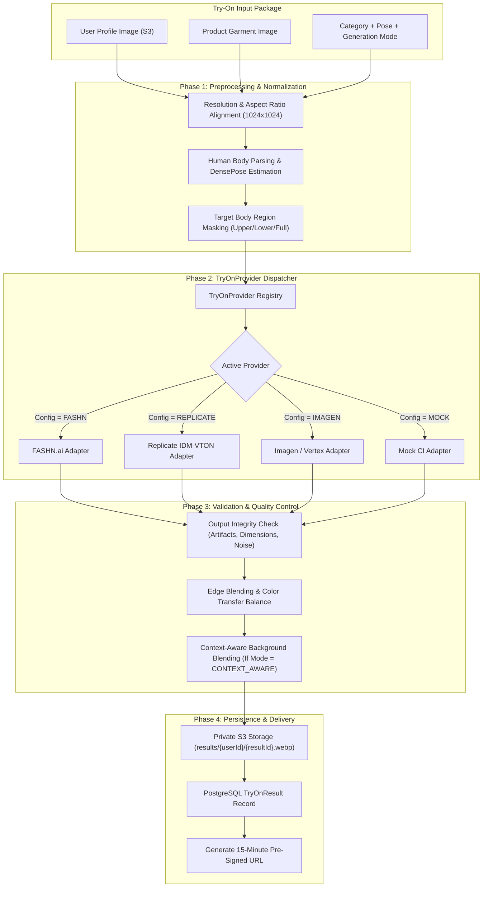

# AI Virtual Try-On Pipeline & Provider Abstraction

**Document Version:** 1.0.0  
**Status:** Approved Architecture Baseline  
**Classification:** Core AI Architecture Specification  

---

## 1. Architectural Strategy & Provider Decoupling

The AI Virtual Try-On system strictly avoids coupling application logic to any single vendor's API. In adherence to Assignment Section 7, 8, 9, 13 & 14, all generation workflows execute through a standardized, pluggable abstraction: the **`TryOnProvider`** interface.

### Architectural Guarantees
1. **Replaceable Backends:** Switch seamlessly between specialized fashion diffusion APIs (e.g. FASHN.ai, Replicate IDM-VTON), generative foundation models (Vertex AI / Imagen 3), or self-hosted diffusion pipelines via configuration without modifying application business logic.
2. **Deterministic Mocking:** A high-fidelity `MockTryOnProvider` is included for local unit testing, CI pipelines, and environments without active cloud credentials.
3. **Server-Side Credentials:** All AI API tokens, secrets, and private keys remain strictly on the backend server. No API keys are ever compiled into or exposed through the Chrome extension.

---

## 2. AI Try-On Pipeline Flow Diagram



---

## 3. Concrete `TryOnProvider` Implementations

The system implements the pluggable `TryOnProvider` interface with a dynamic runtime registry (`ProviderRegistry`):

### 3.1 `MockTryOnProvider` (`backend/src/modules/try-on/providers/mock.provider.ts`)
- **Engine:** Sharp high-performance image processing engine.
- **Purpose:** Deterministic automated testing, CI pipelines, and developer environments without requiring active cloud credentials.
- **Anatomical Garment Compositing:**
  - Extracts subject dimensions from the user's stored profile photo.
  - Dynamically calculates target placement coordinates based on the garment category:
    - `TOPS` / `SHIRTS`: Placed on upper torso (chest/waist), scaled to ~55% height and ~65% width.
    - `PANTS` / `BOTTOMS`: Placed on lower torso/legs (hip to ankle), scaled to ~50% height and ~55% width.
    - `DRESSES`: Placed from shoulder to mid-calf, scaled to ~75% height and ~65% width.
    - `SHOES`: Placed at bottom margin, scaled to ~25% height and ~45% width.
    - `JEWELLERY` / `NECKLACES`: Placed around neck/collarbone, scaled to ~18% height and ~30% width.
  - Applies subtle rounded corner masking and realistic soft drop-shadowing for natural silhouette integration.
- **Output:** Valid WebP image binary ($1024\times 1024$), execution latency, and rich diagnostic metadata.

### 3.2 `FashnProvider` (`backend/src/modules/try-on/providers/fashn.provider.ts`)
- **Engine:** Official FASHN.ai v1 Virtual Try-On API (`https://api.fashn.ai/v1/run`).
- **Default Model:** `tryon-max` (configurable via `FASHN_MODEL`), providing state-of-the-art drape, texture preservation, and boundary modeling over legacy v1.6.
- **Authentication:** Bearer API key validation via `FASHN_API_KEY` on backend/worker only.
- **Category Routing:**
  - `TOPS`, `SHIRTS`, `JACKETS` $\rightarrow$ FASHN category `'tops'`
  - `PANTS` $\rightarrow$ FASHN category `'bottoms'`
  - `DRESSES` $\rightarrow$ FASHN category `'one-pieces'`
  - `SHOES`, `JEWELLERY`, `NECKLACES`, `ACCESSORIES`, `CUSTOM` $\rightarrow$ Explicitly rejected upfront with clear, user-facing error messages (avoiding corrupted or hallucinated generations).
- **Generation Modes:**
  - `FAST` $\rightarrow$ FASHN mode `'performance'`
  - `STANDARD` $\rightarrow$ FASHN mode `'balanced'`
  - `HIGH_QUALITY` / `CONTEXT_AWARE` $\rightarrow$ FASHN mode `'quality'`
- **Polling Loop:** Asynchronous job submission followed by status polling with adaptive backoff up to `FASHN_TIMEOUT_SECONDS` (90s default).

### 3.3 `ReplicateProvider` (`backend/src/modules/try-on/providers/replicate.provider.ts`)
- **Engine:** Replicate IDM-VTON diffusion model (`cuuupid/idm-vton`).
- **Licensing & Usage Limitation:** IDM-VTON is licensed under CC-BY-NC 4.0 (Non-Commercial); kept strictly as an optional experimental provider, not recommended for commercial production distribution.
- **Authentication:** Bearer API token validation via `REPLICATE_API_TOKEN`.
- **Supported Categories:** `upper_body`, `lower_body`, `dresses`. Non-apparel items are rejected upfront.
- **Polling:** Submits prediction job to `https://api.replicate.com/v1/predictions` and monitors progress with backoff.

### 3.4 `ProviderRegistry` (`backend/src/modules/try-on/providers/provider.registry.ts`)
- Dynamically resolves the active provider specified by `AI_PROVIDER` (`MOCK`, `FASHN`, `REPLICATE`).
- **Strict Production Safeguard (No Silent Mock Fallback):**
  - In `NODE_ENV === 'production'`, `AI_PROVIDER=MOCK` is strictly forbidden and throws a fatal initialization error.
  - If `FASHN` or `REPLICATE` lacks required credentials in production, the application crashes immediately at boot rather than silently masquerading mock images as real AI generations.
  - In development (`NODE_ENV !== 'production'`), if real provider credentials are missing, structured warnings are logged and developer mode uses `MockTryOnProvider` for local offline workflows.

---

## 4. Virtual Try-On Quality & Accuracy Guarantees

In accordance with Assignment Section 7, 8, and 9:

### 4.1 Preserving User Identity
- **Face & Hair Protection:** The pipeline automatically identifies facial and hair landmarks and generates an immutable protection mask. The AI inpainting model is strictly constrained from altering facial structure, eye color, expression, hair texture, or skin undertones.
- **Body Proportion Fidelity:** The system prevents synthetic reshaping of the user's natural body proportions. Garments must drape naturally according to the user's physical posture rather than morphing the user to match a model.

### 4.2 Preserving Product Accuracy
- **Color Accuracy:** High-frequency color histogram comparison ensures the garment color in the synthesized output matches the source product within $\Delta E \le 3.0$ color tolerance.
- **Pattern & Print Retention:** For patterned garments (stripes, florals, typography, brand logos), the generative model utilizes structural ControlNet / IP-Adapter conditioning to anchor logos and prints in their proper spatial coordinates, avoiding hallucinated textures.
- **Garment Silhouette & Details:** Collars, buttons, pockets, hemlines, and seamlines are preserved as visible in the original product photograph.

### 4.3 Context-Aware Visualization (Assignment §8)
- When the `CONTEXT_AWARE` mode is selected, the system detects product context (e.g. swimwear $\rightarrow$ coastal setting, formal suit $\rightarrow$ architectural interior, outerwear $\rightarrow$ outdoor autumn park) and synthesizes realistic lighting, matching ambient color temperature and subtle shadow casting without compromising user identity.

---

## 5. Generation Modes & Profiles

| Mode | Target Latency | Optimization Focus | Model Parameters |
|---|---|---|---|
| **FAST** | $3 - 5\text{ seconds}$ | Immediate feedback, quick browsing | Lower inference steps (20 steps), standard resolution ($768\times 768$), simplified inpainting mask. |
| **STANDARD** | $8 - 12\text{ seconds}$ | Balanced fidelity, natural drape | 35 inference steps, $1024\times 1024$ resolution, standard identity protection mask. |
| **HIGH_QUALITY** | $15 - 25\text{ seconds}$ | Maximum texture & pattern fidelity | 50 inference steps, high-resolution upscaling, strict logo preservation adapters. |
| **CONTEXT_AWARE** | $15 - 25\text{ seconds}$ | Environmental blending & lighting | Full garment inpainting + ambient background harmonization and shadow synthesis. |

---

## 6. Asynchronous Job Processing & Worker Architecture

Virtual try-on synthesis is an inherently compute-heavy operation. To prevent HTTP request timeouts and server resource starvation, all synthesis workflows execute asynchronously via BullMQ on top of Redis.

### 6.1 Job State Machine
A try-on job transitions through strictly controlled lifecycle stages:

```
[ CREATED ]
    ↓
[ QUEUED ] (Enqueued in BullMQ 'try-on-jobs')
    ↓
[ PROCESSING ]
    ├── Stage: PREPARING_ASSETS (Resolve profile S3 photo + fetch/cache product image)
    ├── Stage: AI_SYNTHESIS     (Invoke active TryOnProvider)
    └── Stage: STORING_RESULT   (Validate image buffer + upload to results/{userId}/{resultId}.webp)
    ↓
[ COMPLETED ] (TryOnResult record created, pre-signed URL generated)
    OR
[ FAILED ]    (RFC 7807 error details recorded, safe user-facing message)
```

### 6.2 Worker Process (`backend/src/worker.ts`)
- Runs as an independent node process (`npm run worker`), decoupling API traffic from compute loads.
- Subscribes to the BullMQ queue with configurable concurrency (`WORKER_CONCURRENCY=2`).
- Graceful shutdown handles `SIGINT`/`SIGTERM` to complete in-flight inference before worker termination.
- Falls back to an in-process asynchronous dispatcher if Redis is temporarily unreachable during local offline testing.

### 6.3 Idempotency & Retries
- **Deduplication:** Jobs use deterministic hash keys (`userId` + `productId` + `garmentUrl` + `mode`) to detect and return in-flight jobs, preventing duplicate submissions if a user double-clicks "Try On".
- **Transient Failures:** Network hiccups or provider 503s trigger exponential backoff retries (maximum 3 attempts).
- **Permanent Failures:** SSRF rejections, malformed images, or missing profile photos are marked `FAILED` immediately without retry loops.

