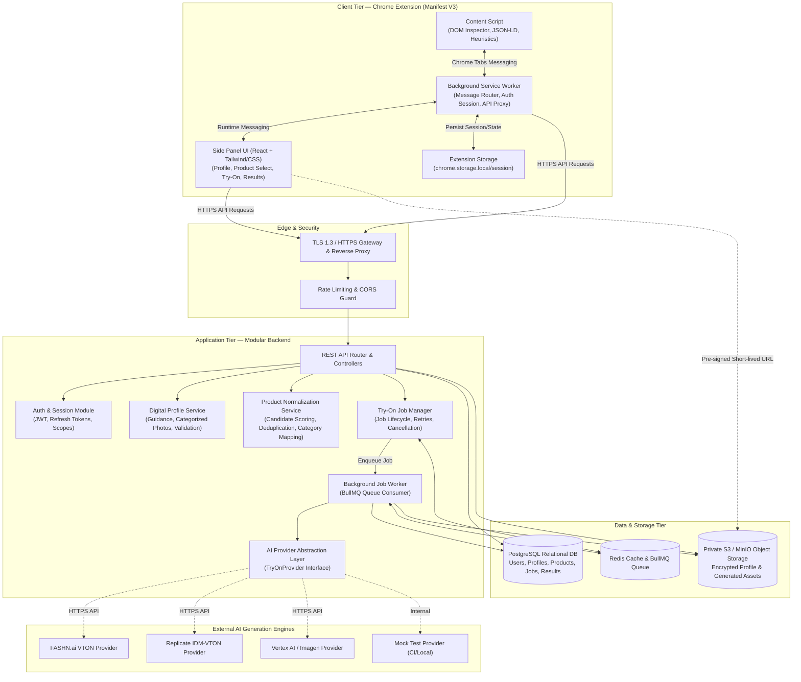
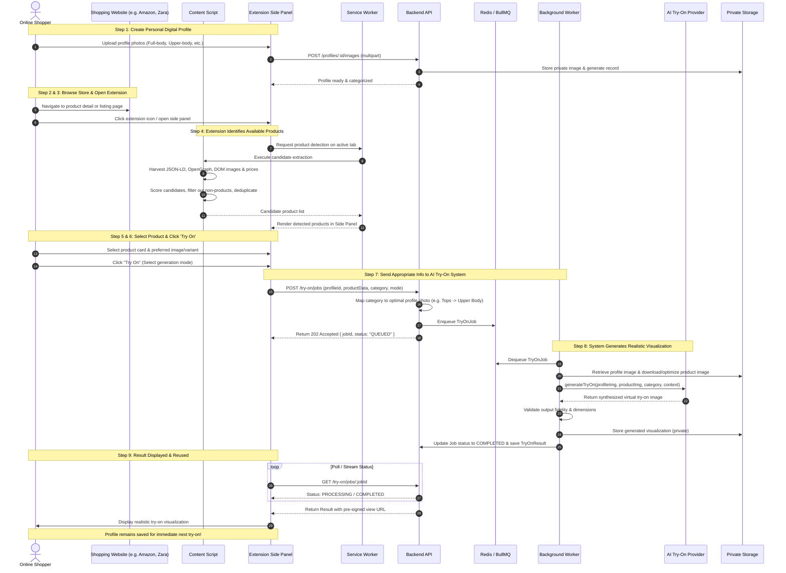

# System Architecture — AI Virtual Try-On Platform

**Document Version:** 1.0.0  
**Status:** Approved Architecture Baseline  
**Classification:** Core Engineering Specification  

---

## 1. High-Level Architecture Overview

The AI Virtual Try-On system is an end-to-end shopping assistant platform designed for high modularity, scalability, and strict data privacy. It operates across three distinct tiers:

1. **Client Tier (Chrome Extension — Manifest V3):** Embedded directly into the user's browser, responsible for non-intrusive DOM inspection, generic e-commerce product extraction, user interaction via the Chrome Side Panel, profile capture guidance, and real-time status reporting.
2. **Application Tier (Backend API & Job Orchestrator):** A modular TypeScript Node.js service providing authenticated REST endpoints, product normalization, image optimization, asynchronous background job queuing via Redis/BullMQ, and AI virtual try-on provider dispatch.
3. **Data Tier (Relational DB & Object Storage):** PostgreSQL for structured relational data (users, profiles, products, try-on jobs, results, history) and private S3-compatible Object Storage (MinIO locally / AWS S3 in production) for sensitive profile photos and generated try-on imagery accessed strictly via pre-signed, time-limited URLs.

---

## 2. System Architecture Diagram

---

## 3. End-to-End User & Data Workflow

The system strictly executes the 9-step core workflow defined in Section 2 of the assignment:

---

## 4. Architectural Principles & Invariants

1. **Non-Intrusive Browser Integration:** The extension content script runs with passive listeners and non-destructive DOM queries. It never injects noisy DOM banners or overrides website CSS styles, reserving all rich UI interactions for the Chrome Side Panel.
2. **Asynchronous Decoupling:** AI image generation takes between 3 to 25 seconds depending on model complexity. HTTP endpoints never block on model completion; they enqueue work into BullMQ and return a trackable `jobId` immediately.
3. **Pluggable AI Abstraction:** All AI interactions flow through a unified `TryOnProvider` TypeScript interface. The application logic is completely decoupled from any single vendor's API schema.
4. **Least-Privilege Media Security:** Personal user photographs and generated results are stored in private object storage buckets. Access is granted solely through cryptographic pre-signed URLs with an expiry TTL of 15 minutes.
5. **Zero Credential Exposure:** Neither cloud storage credentials nor AI API keys are compiled into or transmitted to the Chrome extension. All secrets reside exclusively in backend environment variables.
6. **Graceful Degradation:** If an external AI provider experiences latency or outages, the job orchestrator implements exponential backoff retries and delivers explicit, non-cryptic status messages to the user interface.
