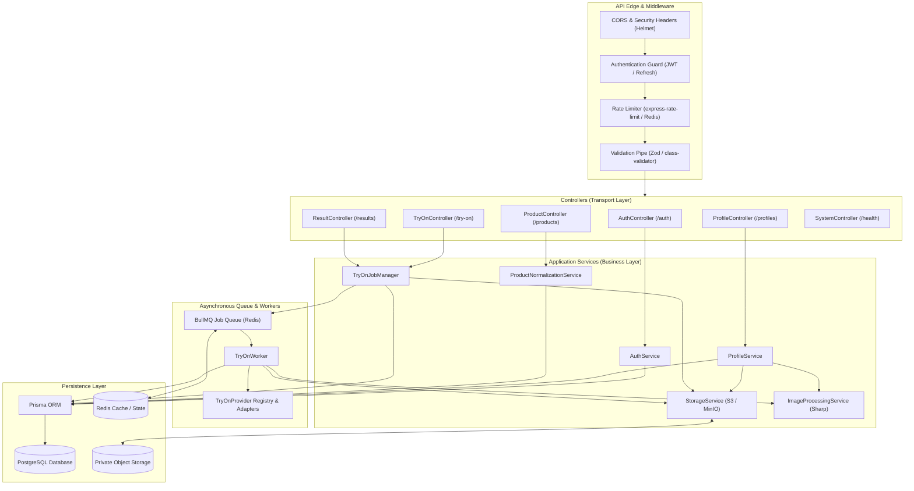

# Backend Architecture — AI Virtual Try-On Platform

**Document Version:** 1.0.0  
**Status:** Approved Architecture Baseline  
**Classification:** Server Architecture Specification  

---

## 1. Architectural Style & Design Principles

The backend is engineered as a **modular, layered REST service** built on Node.js and TypeScript, following Domain-Driven Design (DDD) and Clean Architecture principles:

- **Separation of Concerns:** Strict isolation between HTTP Transport (Controllers/DTOs), Domain Logic (Services), Data Access (Repositories/Prisma ORM), and Asynchronous Workloads (BullMQ Workers).
- **Asynchronous Decoupling:** AI generation workloads are handled by dedicated background workers via a distributed Redis queue, preventing API thread blocking.
- **Fail-Safe Third-Party Integrations:** External AI providers are encapsulated behind interface adapters with circuit breakers, timeouts, and automated retries.
- **Strict Data Privacy:** Zero public storage bucket URLs; all image distribution utilizes time-limited, cryptographically pre-signed URLs.

---

## 2. Layered Architecture Diagram



---

## 3. Core Modules & Responsibilities

### 3.1 Auth & User Management Module
- Manages user registration, login, token refresh, and profile ownership verification.
- Issues short-lived JSON Web Tokens (Access TTL: 15m) and persistent, rotatable Refresh Tokens (TTL: 7d).
- Enforces user tenancy: all profile and job operations require ownership match or reject with `403 Forbidden`.

### 3.2 Digital Profile Module
- Manages the creation, retrieval, and modification of personal body profiles.
- Validates and handles multi-part file uploads for specific body regions (`FRONT_FULL_BODY`, `UPPER_BODY`, `LOWER_BODY`, `FEET`, `FACE`).
- Uses `Sharp` to inspect image metadata, sanitize EXIF data, verify minimum dimensions ($\ge 512\times 512$), and convert to optimized WebP.
- Dispatches image binaries directly to private object storage and persists image records in PostgreSQL.

### 3.3 Product Normalization Module
- Ingests raw candidate payloads from the Chrome extension content script.
- Cleans and deduplicates image URLs, stripping tracking parameters and resolving CDN thumbnail URLs to full-resolution masters.
- Validates and standardizes category enums, title strings, currency codes, and prices.
- Maps product category to the optimal profile photo view (e.g. `TOP` $\rightarrow$ `UPPER_BODY`).

### 3.4 Try-On Job Orchestrator & Worker
- **Job Creation:** `POST /try-on/jobs` creates a persistent `TryOnJob` record with status `CREATED`, registers input snapshots, and enqueues a job payload onto BullMQ.
- **Job Processing Lifecycle:**
  1. Worker pulls job from Redis queue, updates status to `PROCESSING` with timestamp.
  2. Resolves and fetches the designated profile photo from S3 and the product image from source/S3.
  3. Preprocesses and aligns image resolutions (e.g., $1024 \times 1024$ aspect ratio padding/cropping).
  4. Selects the active `TryOnProvider` (e.g. FASHN.ai, Replicate IDM-VTON, Imagen) and executes AI virtual try-on inference.
  5. Validates the generated image (verifies non-empty output, valid image format, dimensions).
  6. Stores the synthesized visualization into private S3 storage under `results/{userId}/{resultId}.webp`.
  7. Creates a `TryOnResult` database record and marks `TryOnJob` status as `COMPLETED`.
  8. Emits a completion event for client polling or webhook notification.
- **Failure Recovery:** Caught exceptions record error codes and user-friendly messages in the job record, transition status to `FAILED`, and trigger backoff retries for transient HTTP 5xx errors (max 3 retries).

### 3.5 Media & Storage Service
- Encapsulates S3-compatible SDK operations (AWS S3 in production, MinIO for local/CI development).
- Exposes:
  - `uploadFile(bucket, key, buffer, mimeType): Promise<string>`
  - `generatePresignedGetUrl(key, expiresInSeconds): Promise<string>`
  - `deleteFile(key): Promise<void>`
  - `deleteFolder(prefix): Promise<void>` (used for account/profile hard deletion).

---

## 4. Error Handling, Logging & Observability

- **Centralized Exception Filter:** Catches domain exceptions and formats them into RFC 7807 Problem Details JSON responses:
  ```json
  {
    "statusCode": 400,
    "error": "BAD_REQUEST",
    "message": "Product image resolution is too low for virtual try-on (minimum 300x300 required)",
    "timestamp": "2026-09-26T07:45:00.000Z",
    "path": "/api/v1/try-on/jobs"
  }
  ```
- **Structured JSON Logging:** Built using Pino/Winston, logging request latency, client user agents, job lifecycle transitions, and AI provider response latencies. Sensitive imagery and PII are redacted from log outputs.
- **Health Checks (`GET /health`):** Verifies active connectivity to PostgreSQL, Redis, and Object Storage, returning `200 OK` or `503 Service Unavailable`.
