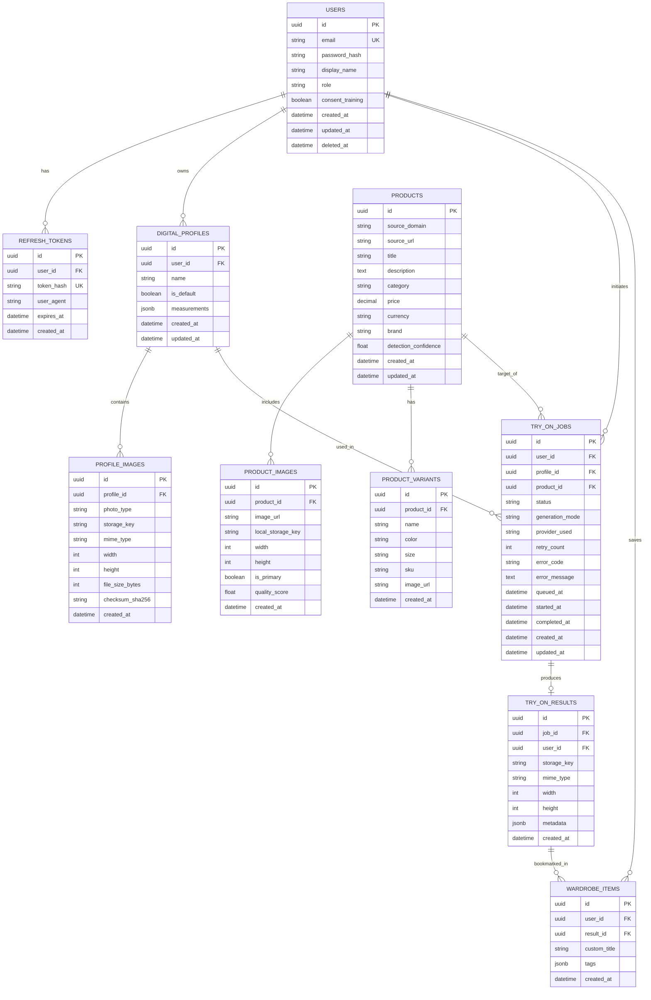

# Database Design & Schema — AI Virtual Try-On Platform

**Document Version:** 1.0.0  
**Status:** Approved Architecture Baseline  
**Classification:** Data Architecture Specification  

---

## 1. Database Overview & Design Strategy

The persistent data layer is implemented using **PostgreSQL** managed through **Prisma ORM**. The schema is designed with the following criteria:

1. **Relational Integrity:** Foreign keys enforce strict relational integrity, cascading deletes where appropriate to ensure GDPR "Right to Erasure" compliance without orphaned storage records.
2. **UUID Primary Keys:** All entity primary keys use UUIDs (UUIDv4/UUIDv7) to prevent enumeration attacks and support distributed scalability.
3. **Optimized Indexing:** Indexes are placed on frequent lookup paths (`userId`, `profileId`, `jobId`, `status`, `createdAt`, `sourceDomain`).
4. **No Binary Blobs:** Media files (photos, generated results) are stored in private S3-compatible object storage; the database stores only canonical storage keys, dimensions, MIME types, and cryptographic hashes.

---

## 2. Entity-Relationship Diagram (ERD)

---

## 3. Detailed Table Specifications

### 3.1 `users`
Represents the authenticated shopper.
- `id` (UUID, Primary Key)
- `email` (VARCHAR(255), Unique, Not Null)
- `password_hash` (VARCHAR(255), Not Null)
- `display_name` (VARCHAR(100))
- `role` (VARCHAR(20), Default: `'USER'`)
- `consent_training` (BOOLEAN, Default: `false`) — Enforces assignment requirement: no use of photos for training without explicit consent.
- `created_at` (TIMESTAMPTZ, Default: `NOW()`)
- `updated_at` (TIMESTAMPTZ)
- `deleted_at` (TIMESTAMPTZ, Nullable) — Soft delete timestamp for audit/retention grace period before physical purge.

### 3.2 `digital_profiles`
Reusable digital body profile owned by a user.
- `id` (UUID, Primary Key)
- `user_id` (UUID, Foreign Key $\rightarrow$ `users.id`, `ON DELETE CASCADE`)
- `name` (VARCHAR(100), Default: `'Default Profile'`)
- `is_default` (BOOLEAN, Default: `true`)
- `measurements` (JSONB, Nullable) — Optional body dimensions (height, chest, waist, hips).
- `created_at` (TIMESTAMPTZ, Default: `NOW()`)
- `updated_at` (TIMESTAMPTZ)

### 3.3 `profile_images`
Individual photos associated with a digital profile across body regions.
- `id` (UUID, Primary Key)
- `profile_id` (UUID, Foreign Key $\rightarrow$ `digital_profiles.id`, `ON DELETE CASCADE`)
- `photo_type` (VARCHAR(50), Not Null) — Enum: `FRONT_FULL_BODY`, `UPPER_BODY`, `LOWER_BODY`, `FEET`, `FACE`, `ADDITIONAL`.
- `storage_key` (VARCHAR(512), Not Null) — Object storage key, e.g. `profiles/{userId}/{profileId}/{id}.webp`.
- `mime_type` (VARCHAR(50), Default: `'image/webp'`)
- `width` (INT, Not Null)
- `height` (INT, Not Null)
- `file_size_bytes` (INT, Not Null)
- `checksum_sha256` (CHAR(64), Not Null)
- `created_at` (TIMESTAMPTZ, Default: `NOW()`)

### 3.4 `products`
Normalized product captured from shopping websites.
- `id` (UUID, Primary Key)
- `source_domain` (VARCHAR(255), Not Null) — e.g. `amazon.com`, `zara.com`.
- `source_url` (TEXT, Not Null)
- `title` (VARCHAR(512), Not Null)
- `description` (TEXT)
- `category` (VARCHAR(50), Not Null) — Enum: `TOPS`, `SHIRTS`, `DRESSES`, `JACKETS`, `PANTS`, `SHOES`, `JEWELLERY`, `NECKLACES`, `ACCESSORIES`.
- `price` (NUMERIC(10,2), Nullable)
- `currency` (VARCHAR(10), Nullable) — e.g. `USD`, `INR`, `EUR`.
- `brand` (VARCHAR(100), Nullable)
- `detection_confidence` (FLOAT, Default: `1.0`)
- `created_at` (TIMESTAMPTZ, Default: `NOW()`)
- `updated_at` (TIMESTAMPTZ)

### 3.5 `try_on_jobs`
Lifecycle tracker for asynchronous AI virtual try-on requests.
- `id` (UUID, Primary Key)
- `user_id` (UUID, Foreign Key $\rightarrow$ `users.id`, `ON DELETE CASCADE`)
- `profile_id` (UUID, Foreign Key $\rightarrow$ `digital_profiles.id`)
- `product_id` (UUID, Foreign Key $\rightarrow$ `products.id`)
- `status` (VARCHAR(30), Not Null, Default: `'CREATED'`) — Enum: `CREATED`, `QUEUED`, `PROCESSING`, `COMPLETED`, `FAILED`, `CANCELLED`.
- `generation_mode` (VARCHAR(30), Default: `'STANDARD'`) — Enum: `FAST`, `STANDARD`, `HIGH_QUALITY`, `CONTEXT_AWARE`.
- `provider_used` (VARCHAR(50), Nullable) — e.g. `FASHN`, `REPLICATE_IDM_VTON`, `IMAGEN`.
- `retry_count` (INT, Default: 0)
- `error_code` (VARCHAR(50), Nullable)
- `error_message` (TEXT, Nullable)
- `queued_at` (TIMESTAMPTZ)
- `started_at` (TIMESTAMPTZ)
- `completed_at` (TIMESTAMPTZ)
- `created_at` (TIMESTAMPTZ, Default: `NOW()`)

### 3.6 `try_on_results`
Persisted output artifacts from completed try-on generations.
- `id` (UUID, Primary Key)
- `job_id` (UUID, Foreign Key $\rightarrow$ `try_on_jobs.id`, `ON DELETE CASCADE`, Unique)
- `user_id` (UUID, Foreign Key $\rightarrow$ `users.id`, `ON DELETE CASCADE`)
- `storage_key` (VARCHAR(512), Not Null) — Object storage key, e.g. `results/{userId}/{id}.webp`.
- `mime_type` (VARCHAR(50), Default: `'image/webp'`)
- `width` (INT, Not Null)
- `height` (INT, Not Null)
- `metadata` (JSONB) — Generation parameters, AI seed, latency, detected garment coordinates.
- `created_at` (TIMESTAMPTZ, Default: `NOW()`)

---

## 4. Privacy & Cascading Deletion Strategy

When a user requests account deletion (`DELETE /user/data` or `DELETE /profiles/:id`):
1. Database foreign keys defined with `ON DELETE CASCADE` automatically purge child records (`digital_profiles`, `profile_images`, `try_on_jobs`, `try_on_results`, `wardrobe_items`).
2. A transactional post-delete hook triggers `StorageService.deleteFolder()` to immediately and irreversibly delete all corresponding binary blobs from the S3 storage bucket.
3. This satisfies Section 14 of the assignment ("Allow the user to delete their profile and generated results").
