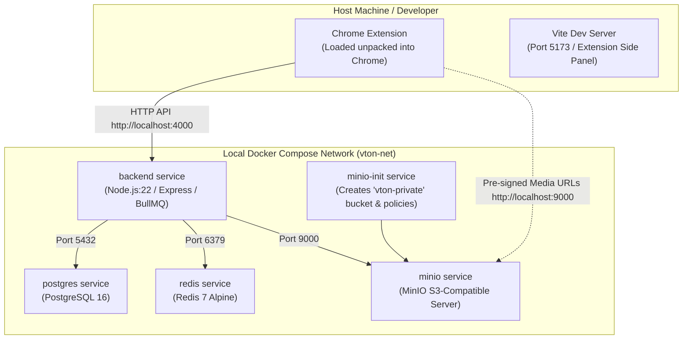
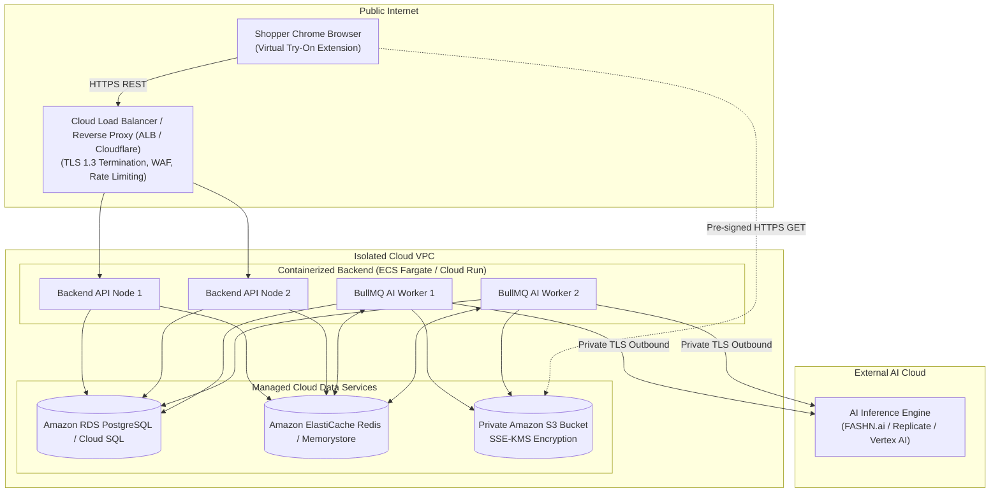

# Deployment & Infrastructure Architecture

**Document Version:** 1.0.0  
**Status:** Approved Architecture Baseline  
**Classification:** DevOps & Infrastructure Specification  

---

## 1. Overview & Deployment Topologies

The system is designed for dual deployment modes:
1. **Local Self-Contained Development Topology:** A complete local environment orchestrated via Docker Compose, including PostgreSQL, Redis, MinIO (mocking S3), and the Node.js backend.
2. **Cloud Production Topology:** A hardened, highly available cloud deployment utilizing managed relational database services, managed Redis, and scalable container instances.

---

## 2. Local Docker Compose Infrastructure



---

## 3. Production Cloud Deployment Topology



---

## 4. Chrome Extension Build & Packaging

The Chrome extension is compiled via Vite:
1. **Build Step:**
   ```bash
   npm run build:extension
   ```
2. **Output Artifact:**
   Compiled files are placed in `/packages/extension/dist/`:
   - `manifest.json` (Valid MV3 schema)
   - `service-worker.js` (Root background worker)
   - `content-script.js` (DOM inspection script)
   - `sidepanel.html` & bundled JS/CSS assets
   - High-resolution icons (`icon-16.png`, `icon-48.png`, `icon-128.png`).
3. **Packaging for Distribution:**
   - Script `npm run zip:extension` compresses `/dist` into `ai-virtual-try-on-extension.zip` ready for Chrome Web Store upload or manual unpacked installation via `chrome://extensions`.

---

## 5. Continuous Integration (CI) Workflow

A GitHub Actions pipeline (`.github/workflows/ci.yml`) executes on every commit and pull request:
1. **Typecheck:** `npm run typecheck` across all monorepo packages (`shared`, `backend`, `extension`).
2. **Linting & Formatting:** ESLint and Prettier verification.
3. **Unit Tests:** Jest / Vitest unit tests verifying product detection heuristics, normalization logic, and category mapping.
4. **Integration Tests:** Dockerized PostgreSQL and Redis spin up in CI to test API endpoints and BullMQ job worker flow with `MockTryOnProvider`.
5. **Extension Build Validation:** Manifest schema linting and bundle size budget checks.
