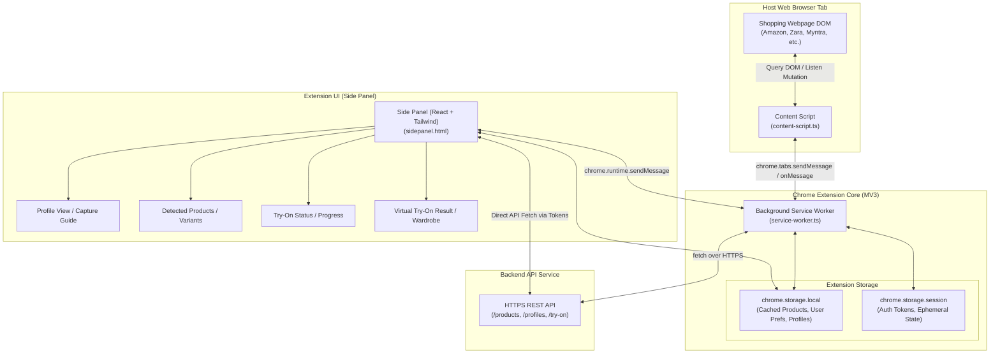

# Chrome Extension Architecture — AI Virtual Try-On

**Document Version:** 1.0.0  
**Status:** Approved Architecture Baseline  
**Classification:** Client Architecture Specification  

---

## 1. Overview & Manifest V3 Strategy

The Chrome Extension acts as the primary user interface and extraction mechanism for the AI Virtual Try-On platform. In accordance with modern Chrome Web Store policies, it is engineered strictly on **Chrome Extensions Manifest V3 (MV3)**.

### Architectural Imperatives
1. **Primary Interface:** The Chrome **Side Panel API** (`chrome.sidePanel`) serves as the core user experience, remaining open alongside active shopping tabs without obscuring product photos, prices, or reviews.
2. **Stateless Service Worker:** The background service worker (`service-worker.ts`) operates ephemerally, reacting to browser events, routing messages between the Side Panel and Content Script, and managing authentication tokens. It never relies on in-memory global variables.
3. **Non-Destructive Content Script:** Injected on demand or on matching shopping sites, the content script inspects DOM structures, parses structured data (JSON-LD, microdata), and extracts product imagery without injecting conflicting styles or altering host page scripts.
4. **Resilient Storage:** Session data and tokens are managed via `chrome.storage.session` and `chrome.storage.local`.

---

## 2. Extension Architecture & Message Flow



---

## 3. Component Breakdown & Responsibilities

### 3.1 Content Script (`content-script.ts`)
- **Injection Policy:** Runs on all standard `http://*/*` and `https://*/*` pages.
- **Responsibilities:**
  - Detect whether the current page is an e-commerce page using heuristic triggers (e.g. price indicators, `Schema.org/Product`, cart button presence).
  - Extract structured JSON-LD, OpenGraph, microdata, and Twitter card tags.
  - Perform semantic image discovery: inspect `img`, `picture`, `srcset`, and background images, filtering out icons, avatars, and ads based on dimension heuristics (>200x200px) and aspect ratios.
  - Extract product titles, descriptions, visible prices, currencies, and color/size variants.
  - Score candidates and send normalized candidate packages to the background service worker or side panel upon request.
  - Support high-performance mutation observation (`MutationObserver`) with debouncing (300ms) for dynamic Single-Page Applications (e.g. React/Vue storefronts).

### 3.2 Background Service Worker (`service-worker.ts`)
- **Lifecycle Management:** Activated on extension install, browser startup, or message dispatch. Terminates automatically after 30 seconds of inactivity.
- **Side Panel Activation:**
  ```typescript
  // Configured to automatically launch side panel upon clicking extension icon
  chrome.sidePanel.setPanelBehavior({ openPanelOnActionClick: true })
    .catch((error) => console.error("Failed to set side panel behavior:", error));
  ```
- **Message Router:** Dispatches actions between Content Scripts and the Side Panel (e.g. `DETECT_PRODUCTS`, `GET_CURRENT_TAB_PRODUCTS`, `PING`).
- **Token & Caching Layer:** Proxies authentication refresh events and synchronizes cached state across browser windows.

### 3.3 Side Panel UI (`sidepanel/`)
- **Technology:** React 19 + TypeScript + Vite + Tailwind CSS design system.
- **Primary Views:**
  1. **Profile Setup & Management:** Guidance modal with pose instructions; image dropzones for Full-body, Upper-body, Lower-body, Feet, and Face photographs; upload progress and server validation feedback.
  2. **Product Feed:** Displays candidate products discovered on the active tab; handles single product detail pages (PDP) as well as multi-product catalog/listing pages (PLP); allows switching between discovered products.
  3. **Product Inspector & Variant Picker:** Allows selecting alternate angles (e.g. front view vs back view) or color variants; category selector with auto-detected badge and manual override dropdown.
  4. **Try-On Action Bar:** Mode selector (`FAST`, `STANDARD`, `HIGH_QUALITY`, `CONTEXT_AWARE`); one-click "Try On" trigger.
  5. **Job Progress Monitor:** Visual progress stepper reflecting real-time backend state (`QUEUED` $\rightarrow$ `PROCESSING` $\rightarrow$ `COMPLETED`).
  6. **Result Gallery & Wardrobe:** High-definition image preview, split before/after comparison slider, download action, and save to virtual wardrobe.

---

## 4. Message Passing Protocol

All extension communication uses structured, type-safe message envelopes:

```typescript
export interface ExtensionMessage<T = any> {
  type: ExtensionMessageType;
  payload: T;
  source: 'CONTENT_SCRIPT' | 'SERVICE_WORKER' | 'SIDE_PANEL';
  timestamp: number;
}

export enum ExtensionMessageType {
  TRIGGER_PRODUCT_DETECTION = 'TRIGGER_PRODUCT_DETECTION',
  PRODUCT_DETECTION_RESULT = 'PRODUCT_DETECTION_RESULT',
  TAB_URL_CHANGED = 'TAB_URL_CHANGED',
  AUTH_STATE_CHANGED = 'AUTH_STATE_CHANGED',
  START_TRY_ON = 'START_TRY_ON',
  JOB_STATUS_UPDATE = 'JOB_STATUS_UPDATE',
}
```

---

## 5. Storage & State Management Matrix

| Storage Mechanism | Purpose | Data Items | Expiry / Eviction |
|---|---|---|---|
| `chrome.storage.session` | Volatile runtime credentials & tab context | Access Token, Active Tab ID, Transient Form State | Cleared when browser session ends |
| `chrome.storage.local` | Persistent preferences & cached metadata | Active Profile ID, User Display Name, Recent Try-On Results Cache | Persists across browser restarts; user clearable |
| `IndexedDB` (Side Panel) | High-resolution image caching | Temporary thumbnail blobs for instant UI rendering | LRU cache limited to 50MB |

---

## 6. Multi-Product vs Single-Product Handling

The side panel UI adapts dynamically based on the active page type:

1. **Product Detail Page (PDP):**
   - Single high-confidence product detected ($Confidence \ge 0.85$).
   - UI automatically highlights the primary garment, extracts all gallery thumbnails, and pre-selects the optimal front-facing image.
   - Immediate "Try On" primary button enabled.
2. **Product Listing Page (PLP) / Search Results:**
   - Multiple candidate cards detected ($N \ge 2$).
   - Side panel displays a responsive grid of selectable product cards with thumbnail, title, price, and category badge.
   - Clicking a card promotes it to the active inspection view with variant selection and the "Try On" action.
