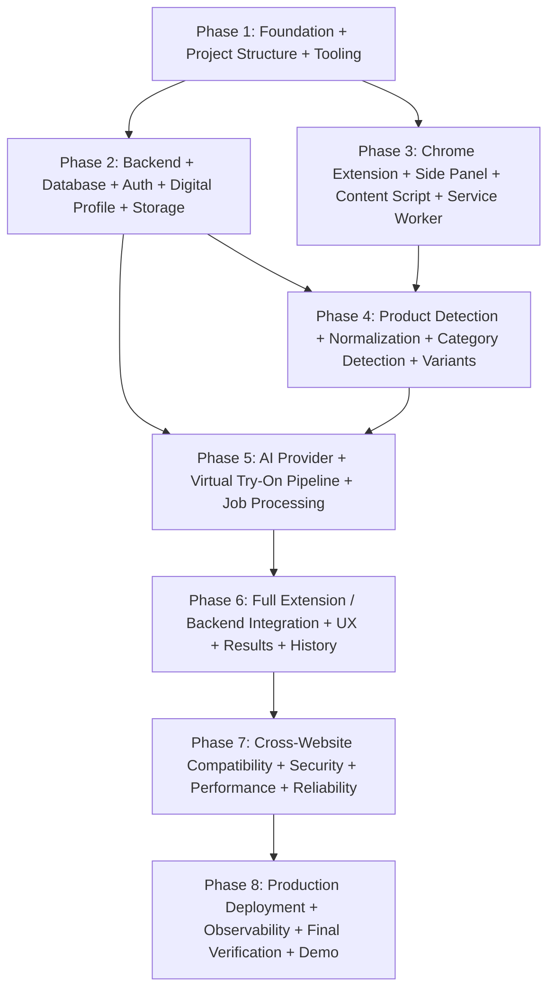

# Master Implementation Plan — AI Virtual Try-On Platform

**Document Version:** 1.0.0  
**Status:** Approved Architecture Baseline  
**Classification:** Engineering Roadmap & Execution Plan  

---

## 1. Overview & Phasing Strategy

The project implementation is structured into **eight large logical phases**. Each phase delivers a complete, cohesive, testable vertical capability, avoiding fragmentation while maintaining clear architectural boundaries.

---

## 2. Phase Breakdown

---

### Phase 1: Foundation + Project Structure + Tooling
- **Objectives:** Establish the monorepo workspace, TypeScript base configurations, linting, formatting, shared type packages, environment configs, and dockerized local services.
- **Dependencies:** Node.js v22+, npm workspaces, Docker.
- **Files/Modules:**
  - Root: `package.json`, `tsconfig.base.json`, `AGENTS.md`, `.gitignore`, `.env.example`.
  - Packages: `/packages/shared`, `/packages/backend`, `/packages/extension`.
  - Infrastructure: `/infrastructure/docker-compose.yml`, `/infrastructure/Dockerfile.backend`.
- **APIs:** None (Tooling phase).
- **Database Changes:** Setup PostgreSQL 16 container, Prisma schema baseline.
- **Frontend / Extension Changes:** Base Vite + React project configuration with Manifest V3 scaffolding.
- **Risks:** Cross-package TypeScript resolution conflicts. *Mitigation:* Explicit npm workspace references and unified `tsconfig.base.json`.
- **Verification:** `npm run build` and `npm run typecheck` run cleanly across all packages; `docker compose up -d` brings up PostgreSQL, Redis, and MinIO.
- **Definition of Done:** Monorepo boots, all packages build cleanly with zero type errors, infrastructure starts successfully.

---

### Phase 2: Backend + Database + Auth + Digital Profile + Storage
- **Objectives:** Build the core backend service: Prisma schema migrations, JWT authentication, user tenancy, S3/MinIO private object storage integration, and personal digital profile management.
- **Dependencies:** Phase 1 complete.
- **Files/Modules:**
  - `/packages/backend/src/modules/auth/`
  - `/packages/backend/src/modules/profiles/`
  - `/packages/backend/src/modules/storage/`
  - `/packages/backend/src/database/schema.prisma`
- **APIs:**
  - `POST /auth/register`, `POST /auth/login`, `POST /auth/refresh`, `GET /auth/me`
  - `GET /profiles`, `POST /profiles`, `POST /profiles/:id/images`, `DELETE /profiles/:id/images/:imageId`, `DELETE /profiles/:id`
  - `DELETE /user/data`
- **Database Changes:** `users`, `refresh_tokens`, `digital_profiles`, `profile_images` tables migrated.
- **Frontend / Extension Changes:** None.
- **Risks:** Unhandled image corruption or memory leaks during high-res image uploads. *Mitigation:* Use `Sharp` with stream processing and strict size/MIME limits.
- **Verification:** Automated integration tests passing for registration, login, profile photo upload to MinIO, pre-signed URL generation, and user deletion.
- **Definition of Done:** Authenticated users can upload, view via pre-signed URLs, and delete categorized profile photos; zero public S3 access.

---

### Phase 3: Chrome Extension + Side Panel + Content Script + Service Worker
- **Objectives:** Implement the Chrome Extension Manifest V3 core: Side Panel UI with modern Tailwind styling, Service Worker lifecycle handling, non-destructive Content Script injection, and extension storage syncing.
- **Dependencies:** Phase 1 complete.
- **Files/Modules:**
  - `/packages/extension/src/manifest.json`
  - `/packages/extension/src/background/service-worker.ts`
  - `/packages/extension/src/content/content-script.ts`
  - `/packages/extension/src/sidepanel/` (React UI components: Navigation, Auth form, Profile management).
- **APIs:** Client integration with Backend Auth and Profile endpoints.
- **Database Changes:** None.
- **Frontend / Extension Changes:** Side panel layout, photo capture guidance modal with visual posture tips, authentication drawer, active profile status badge.
- **Risks:** Service worker termination losing ephemeral state. *Mitigation:* Persist session tokens in `chrome.storage.session` and local configs in `chrome.storage.local`.
- **Verification:** Extension loads unpacked in Chrome; clicking the action opens the side panel; user can log in and view their digital profile within the side panel.
- **Definition of Done:** Side panel runs smoothly alongside active browser tabs, authenticates with backend, and displays user profile with capture guidance.

---

### Phase 4: Product Detection + Normalization + Category Detection + Variants
- **Objectives:** Implement the generic product detection engine capable of harvesting product data across arbitrary e-commerce sites, ranking multiple candidate images, and classifying categories.
- **Dependencies:** Phase 2, Phase 3.
- **Files/Modules:**
  - `/packages/extension/src/content/harvesters/` (JSON-LD, OpenGraph, DOM images, contextual text).
  - `/packages/extension/src/content/scoring/` (Candidate filtering, confidence calculation).
  - `/packages/shared/src/taxonomy/` (Category taxonomy, keyword dictionary).
  - `/packages/backend/src/modules/products/` (Product normalization service).
- **APIs:** `POST /products/normalize`, `GET /products/:id`.
- **Database Changes:** `products`, `product_images`, `product_variants` tables.
- **Frontend / Extension Changes:** Side panel detected product feed; single-product view vs multi-product listing grid; variant and angle selector.
- **Risks:** Single-page app client-side navigation not updating detected products. *Mitigation:* Implement debounced `MutationObserver` and URL change listeners.
- **Verification:** Test detection on real product pages (Amazon, Zara, Myntra, Shopify demo); verify accurate title, price, high-res image, and category extracted.
- **Definition of Done:** Generic product detector extracts products with $>80\%$ confidence on both PDP and PLP pages; user can select variants in the side panel.

---

### Phase 5: AI Provider + Virtual Try-On Pipeline + Job Processing
- **Objectives:** Implement the pluggable AI Virtual Try-On pipeline (`TryOnProvider`), Redis / BullMQ asynchronous job queue, background worker processing, and image compositing.
- **Dependencies:** Phase 2, Phase 4.
- **Files/Modules:**
  - `/packages/backend/src/modules/ai/providers/` (`TryOnProvider` interface, `MockTryOnProvider`, `FashnProvider`, `ReplicateProvider`).
  - `/packages/backend/src/modules/jobs/` (BullMQ try-on job queue, TryOnWorker).
  - `/packages/backend/src/modules/try-on/` (TryOnController, TryOnService).
- **APIs:** `POST /try-on/jobs`, `GET /try-on/jobs/:id`, `POST /try-on/jobs/:id/cancel`.
- **Database Changes:** `try_on_jobs`, `try_on_results` tables.
- **Frontend / Extension Changes:** Real-time generation progress monitor with multi-step status indicator.
- **Risks:** AI provider rate limiting or timeouts blocking workers. *Mitigation:* BullMQ backoff retries, provider circuit breaker, configurable mock fallback.
- **Verification:** Unit tests for AI provider adapters; integration test executing complete job queue lifecycle from `CREATED` to `COMPLETED` with stored output image.
- **Definition of Done:** Try-on requests run asynchronously in background workers, synthesize images preserving user identity and garment fidelity, and save results.

---

### Phase 6: Full Extension / Backend Integration + UX + Results + History
- **Objectives:** Complete the end-to-end user loop: triggering try-ons from the side panel, polling progress, displaying high-res visualizations, split before/after comparison, virtual wardrobe history, and result deletion.
- **Dependencies:** Phase 3, Phase 4, Phase 5.
- **Files/Modules:**
  - `/packages/extension/src/sidepanel/components/ResultViewer.tsx`
  - `/packages/extension/src/sidepanel/components/WardrobeGallery.tsx`
  - `/packages/extension/src/sidepanel/components/CompareSlider.tsx`
  - `/packages/backend/src/modules/results/`
- **APIs:** `GET /try-on/results`, `GET /try-on/results/:id`, `DELETE /try-on/results/:id`, `GET /wardrobe`.
- **Database Changes:** `wardrobe_items` table.
- **Frontend / Extension Changes:** Interactive comparison slider, high-res zoom modal, download button, wardrobe tab.
- **Risks:** Large image payloads slowing down side panel rendering. *Mitigation:* Deliver WebP images via pre-signed CDN URLs with responsive srcset.
- **Verification:** End-to-end user test: browse store $\rightarrow$ detect product $\rightarrow$ click Try On $\rightarrow$ watch progress $\rightarrow$ view result $\rightarrow$ save to wardrobe $\rightarrow$ try second product with same profile.
- **Definition of Done:** Full core workflow operates seamlessly; user can reuse their digital profile repeatedly for multiple products without re-uploading.

---

### Phase 7: Cross-Website Compatibility + Security + Performance + Reliability
- **Objectives:** Hardening and audit: cross-site testing on major e-commerce platforms, security vulnerability scanning, rate limiting enforcement, memory leak audits, and image compression tuning.
- **Dependencies:** Phase 6 complete.
- **Files/Modules:**
  - `/packages/extension/src/content/adapters/` (Amazon, Zara, Myntra domain adapters).
  - `/packages/backend/src/middleware/rate-limiter.ts`
  - `/packages/backend/src/middleware/security-headers.ts`
- **APIs:** Rate limiting applied to all public and authenticated routes.
- **Database Changes:** Performance indexes applied on frequent query columns.
- **Frontend / Extension Changes:** Performance optimizations (debounced DOM queries, caching recent tab scans).
- **Risks:** Aggressive site anti-scraping scripts interfering with extension. *Mitigation:* Extension operates strictly in passive DOM read mode without bot-like behavior.
- **Verification:** Automated and manual test passes across Amazon, Zara, Myntra, ASOS, and H&M; security audit confirms zero leaked keys; privacy purge verified.
- **Definition of Done:** System runs reliably across heterogeneous stores; security and privacy audits pass with 100% compliance.

---

### Phase 8: Production Deployment + Observability + Final Verification + Demo
- **Objectives:** Prepare production deployment configurations, automated CI/CD pipeline, monitoring/health checks, demonstration script, and complete deliverable packaging.
- **Dependencies:** All previous phases complete.
- **Files/Modules:**
  - `.github/workflows/ci.yml`
  - `/infrastructure/docker-compose.prod.yml`
  - `/docs/demonstration-guide.md`
  - Extension build packaging scripts (`npm run build:extension`, `npm run zip:extension`).
- **APIs:** `GET /health` with comprehensive subsystem health status.
- **Database Changes:** Production migration scripts verified.
- **Frontend / Extension Changes:** Production extension bundle optimized for Chrome Web Store submission.
- **Risks:** Deployment environment differences breaking pre-signed S3 URLs. *Mitigation:* Environment-variable-driven S3 endpoint and signature configuration.
- **Verification:** Complete execution of all 9 steps of the Mandatory Demonstration Checklist (Assignment §16).
- **Definition of Done:** All deliverables ready: source code, working extension build, database migrations, setup instructions, architecture docs, and demonstration readiness.
