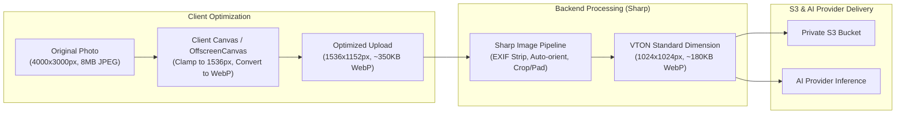

# Performance & Optimization Architecture

**Document Version:** 1.0.0  
**Status:** Approved Architecture Baseline  
**Classification:** Engineering Performance Specification  

---

## 1. Objectives & Performance Goals

Section 15 of the assignment mandates that:
> *"The try-on experience should be designed to minimize unnecessary waiting. Optimize product-image retrieval. Avoid repeatedly uploading the same profile images. Use appropriate image sizes. Show generation progress. Handle failed AI requests gracefully. Cache reusable information where appropriate."*

### Key Performance Indicators (KPIs)
- **Product Detection Latency:** $\le 400\text{ ms}$ for DOM inspection and candidate extraction on active tabs.
- **Side Panel First Contentful Paint:** $\le 250\text{ ms}$.
- **Profile Image Re-use Efficiency:** $100\%$ zero repeated upload overhead on repeated try-ons.
- **Image Payload Optimization:** $\ge 60\%$ reduction in transfer size via client and backend WebP conversion.
- **Job Status Polling Overhead:** $\le 1\text{ request every 1.5 seconds}$ during active generation.

---

## 2. Image Pipeline Optimization



### Techniques
1. **Client-Side Image Clamping:** Profile photos captured on modern smartphones are frequently 12–48 megapixels (8–20MB). The extension downscales photos to max 1536px on its longest edge and converts them to WebP (quality 85) prior to transmission. This saves significant bandwidth and battery life.
2. **Server-Side Normalization (`Sharp`):** The backend normalizes all try-on inputs to $1024\times 1024$ resolution with proportional aspect ratio preservation (padding with neutral margin or smart border extension), matching AI diffusion model training resolutions and preventing inference failures.
3. **Product Image CDN Optimization:** E-commerce stores often render thumbnail versions (e.g. `150x150`) on catalog pages. The product detection engine cleans regex patterns (e.g. `._AC_SR150,150_.jpg` $\rightarrow$ `.jpg`) to download master source images directly, eliminating multi-hop redirect delays.

---

## 3. Reusable Profile & Zero Repeated Uploads

- When a user selects a product on Amazon, Myntra, or Zara and clicks "Try On", the extension transmits only the `profileId` and the `productId` / product image URL.
- The backend resolves the cached `profileImageUrl` directly from S3.
- Result: **0 bytes of user photo uploaded per shopping try-on**.

---

## 4. Multi-Tier Caching Architecture

| Cache Tier | Storage Engine | Cached Items | TTL / Invalidation Policy |
|---|---|---|---|
| **L1 (Client Extension)** | `chrome.storage.local` | Discovered products per URL, User Profile Summary | Evicted on URL change or tab close; max 50 items |
| **L2 (Backend Memory/Redis)** | Redis Cluster | Product normalization results by source URL hash | 24 hours (avoids redundant scraping of common products) |
| **L3 (Job State Cache)** | Redis Hashes | Active `TryOnJob` status, progress percentage, error states | 1 hour post-completion |
| **L4 (Media CDN / Pre-signed)** | Private S3 + CloudFront / Direct | Pre-signed GET URLs | 15 minutes (cryptographic expiry) |

---

## 5. User Feedback & Generation Progress Stepper

Because AI image synthesis requires 4 to 20 seconds depending on provider workload, the user experience must never leave the shopper in an ambiguous state:

```
[ Step 1: Initializing ] ---> [ Step 2: Analyzing Garment ] ---> [ Step 3: Inpainting Fit ] ---> [ Step 4: Finalizing Result ]
         (0% - 15%)                     (15% - 40%)                     (40% - 85%)                     (85% - 100%)
```

- If an AI provider fails or experiences rate limits, the worker automatically re-routes to an alternate provider or triggers backoff retries, alerting the user via the progress monitor: *"AI provider busy, optimizing rendering pipeline..."*

---

## 6. Job Idempotency & Efficient Polling

### 6.1 Duplicate Job Prevention
- Submitting a try-on computes an idempotency key based on `userId`, `productId`, `garmentImageUrl`, and `generationMode`.
- If an existing active job (`QUEUED` or `PROCESSING`) exists with matching parameters, the existing `jobId` is returned immediately rather than generating redundant queue jobs and invoking costly AI provider calls.

### 6.2 Adaptive Client-Side Polling
- The Chrome Extension polls `GET /try-on/jobs/:id` using adaptive timing:
  - Initial poll starts at 1.5 seconds.
  - Polling interval dynamically slows to 3 seconds after 10 seconds of processing.
  - Immediate termination upon encountering `COMPLETED` or `FAILED` states.
  - Automatic cleanup of polling timers when unmounting or navigating away from the try-on tab.

