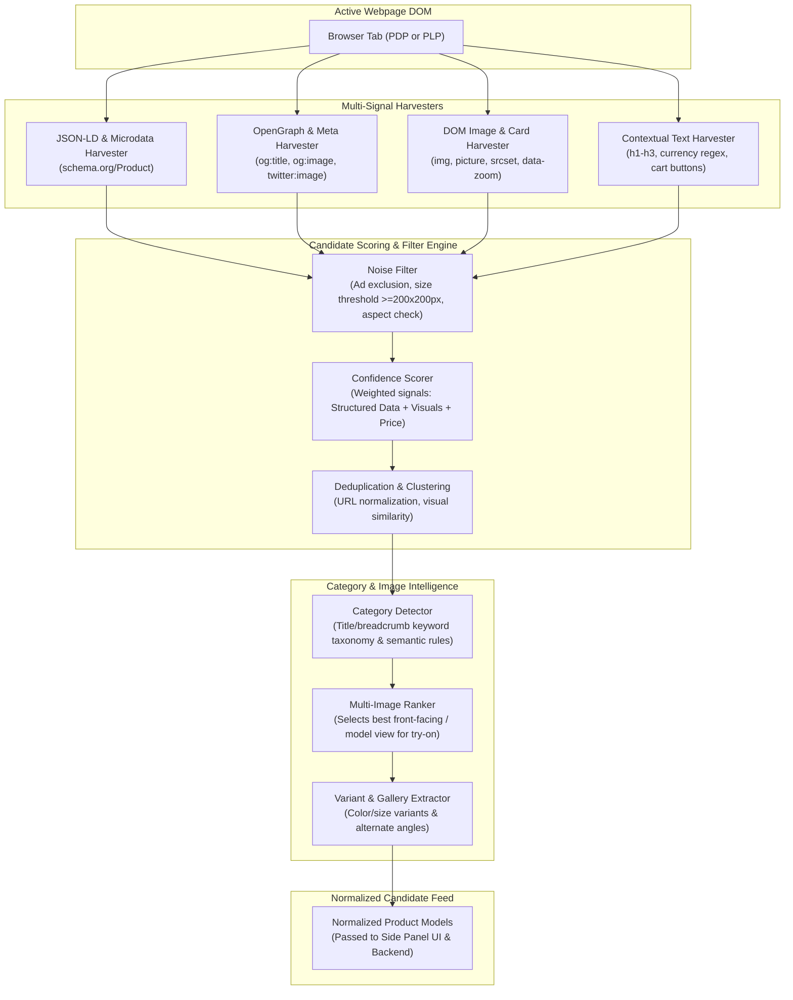

# Product Detection Architecture & Pipeline

**Document Version:** 1.0.0  
**Status:** Approved Architecture Baseline  
**Classification:** Client Heuristic Specification  

---

## 1. Overview & Detection Philosophy

The central mandate of the product detection system (Assignment Sections 5, 6, 10 & 12) is to **work across heterogeneous e-commerce platforms without being hard-coded to a single website** (e.g. Amazon, Zara, or Myntra).

To achieve this, the architecture adopts a **multi-signal heuristic extraction pipeline** that harvests structured metadata, semantic HTML, DOM image hierarchies, and contextual text cues. Extracted candidates are scored probabilistically, deduplicated, and normalized into standard product entities.

---

## 2. Product Detection Pipeline Diagram

---

## 3. Signal Harvesters & Heuristics

### 3.1 Structured Data Harvester (`JSON-LD` & `Microdata`)
- Queries all `<script type="application/ld+json">` elements.
- Parses objects matching `@type: "Product"`, `@type: "IndividualProduct"`, or nested product offers.
- Extracts high-confidence fields: `name`, `description`, `image` (handles arrays or strings), `offers.price`, `offers.priceCurrency`, `brand.name`, `category`.
- Confidence contribution: $+0.45$.

### 3.2 OpenGraph & Semantic Metadata Harvester
- Extracts `<meta property="og:title">`, `<meta property="og:image">`, `<meta property="og:image:secure_url">`.
- Inspects e-commerce meta tags: `<meta property="product:price:amount">`, `<meta property="product:price:currency">`.
- Extracts Twitter card imagery: `<meta name="twitter:image">`.
- Confidence contribution: $+0.25$.

### 3.3 Visual DOM & Image Tree Harvester
- Inspects ``, `<picture>`, and background image elements.
- Resolves high-resolution targets from attributes: `srcset`, `data-src`, `data-zoom-image`, `data-large`, `data-original`.
- Strips CDN dynamic thumbnail transformation parameters (e.g. `._AC_SX450_.jpg` on Amazon $\rightarrow$ master image).
- Calculates computed dimensions: rejects images with natural width or height $< 200\text{px}$ or extreme aspect ratios ($> 1:3$ or $> 3:1$).
- Confidence contribution: $+0.20$.

### 3.4 Contextual Text & Commerce Action Harvester
- Locates prominent headings (`<h1>`, `<h2>`) within proximity to detected imagery.
- Scans for standardized international currency formats: `$`, `€`, `£`, `₹`, `¥`, `USD`, `INR`, `EUR`.
- Identifies e-commerce action markers: "Add to Cart", "Buy Now", "Add to Bag", "Out of Stock".
- Confidence contribution: $+0.10$.

---

## 4. Candidate Scoring & Filtering Engine

Each extracted candidate accumulates a confidence score $S \in [0.0, 1.0]$:

$$S = w_{json} S_{json} + w_{og} S_{og} + w_{dom} S_{dom} + w_{text} S_{text}$$

- **High-Confidence Threshold ($S \ge 0.65$):** Directly promoted to candidate list.
- **Noise Rejection:** Images matching known banner/tracking patterns (e.g., `sprite`, `logo`, `banner`, `badge`, `icon`, `advertisement`, `rating`, `payment`) are penalized ($S = 0$) and discarded.
- **Deduplication:** Multiple candidate images belonging to the same product group are clustered by DOM parent hierarchy (e.g., closest `.product-card`, `.grid-item`, or `article` element).

---

## 5. Automatic Product Category Detection

The category engine maps product titles, breadcrumbs, and descriptions against a hierarchical fashion taxonomy:

| Category | Typical Keywords & Detection Regex | Anatomical Try-On Target |
|---|---|---|
| **T-shirts & Tops** | `t-shirt`, `tee`, `top`, `blouse`, `tank`, `crop top`, `camisole`, `polo` | Upper Body |
| **Shirts** | `shirt`, `button-down`, `oxford`, `flannel`, `formal shirt` | Upper Body |
| **Dresses** | `dress`, `gown`, `frock`, `maxi`, `midi dress`, `jumpsuit`, `romper` | Full Body |
| **Jackets & Outerwear** | `jacket`, `blazer`, `coat`, `hoodie`, `cardigan`, `sweater`, `parka` | Upper Body |
| **Pants & Trousers** | `pants`, `trousers`, `jeans`, `denim`, `chinos`, `shorts`, `leggings` | Lower Body |
| **Shoes & Footwear** | `shoes`, `sneakers`, `boots`, `heels`, `loafers`, `sandals`, `flats` | Feet |
| **Jewellery & Necklaces**| `necklace`, `pendant`, `choker`, `chain`, `jewellery`, `earrings` | Face / Neck |
| **Accessories** | `scarf`, `belt`, `hat`, `cap`, `sunglasses`, `watch`, `bag` | Contextual Anchor |

---

## 6. Multiple Product Images & Variant Selection

Section 10 of the assignment mandates selecting the best input image when multiple are present:
1. **Front-Facing Model vs Flat-Lay:** AI models perform best when given a clear front-facing garment view. Images containing tokens like `front`, `model`, `lookbook`, `main` are scored higher than `back`, `side`, `detail`, `swatch`.
2. **Resolution Ranking:** Candidates with highest resolution and least background noise are prioritized.
3. **User Selection:** The extension UI presents an interactive thumbnail reel of all discovered product angles and color swatches, allowing the user to override and select the exact view to try on.

---

## 7. Website Adapter Extensibility

While generic extraction handles over 85% of standard e-commerce pages, specific high-traffic sites (e.g. Amazon, Zara, Myntra) use heavily obfuscated DOM structures. The architecture includes an **Adapter Registry**:
- If a registered adapter matches the active hostname (`*.amazon.*`, `*.zara.*`, `*.myntra.*`), its domain-specific selectors run first.
- If the adapter fails or is not present, the generic extraction pipeline executes transparently as the primary fallback.
- This ensures maximum cross-site compatibility without brittle coupling.
