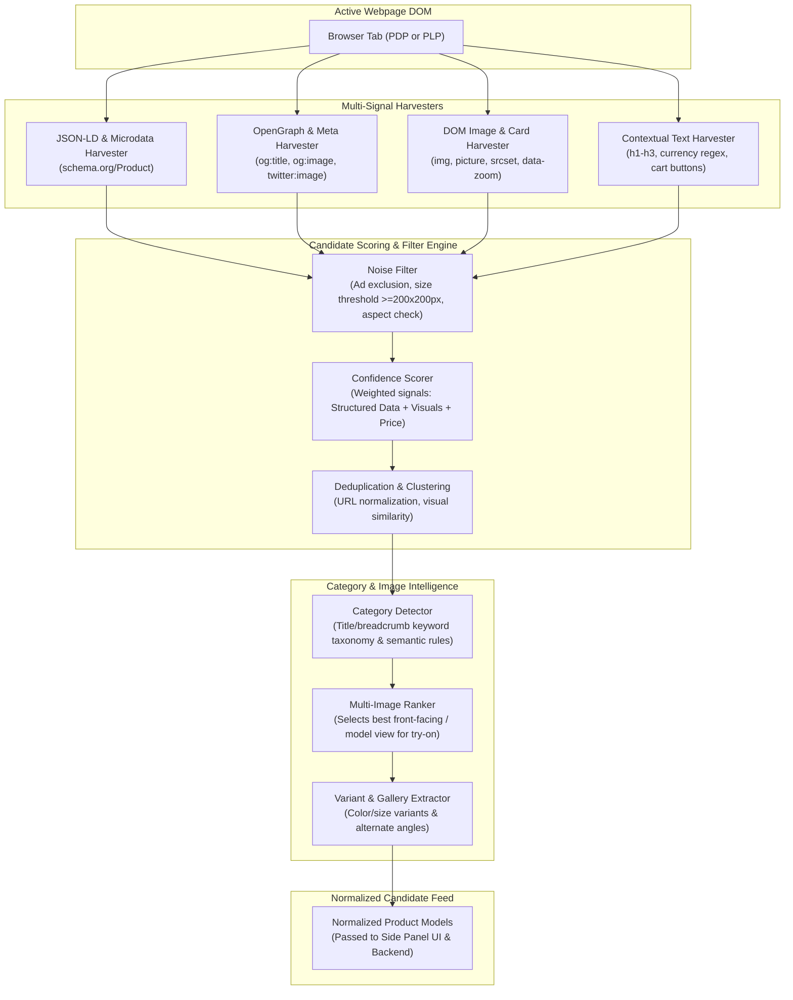

# Product Detection Architecture & Pipeline

**Document Version:** 1.0.0  
**Status:** Approved Architecture Baseline  
**Classification:** Client Heuristic Specification  

---

## 1. Overview & Detection Philosophy

The central mandate of the product detection system (Assignment Sections 5, 6, 10 & 12) is to **work across heterogeneous e-commerce platforms without being hard-coded to a single website** (e.g. Amazon, Zara, or Myntra).

To achieve this, the architecture adopts a **multi-signal heuristic extraction pipeline** that harvests structured metadata, semantic HTML, DOM image hierarchies, and contextual text cues. Extracted candidates are scored probabilistically, deduplicated, and normalized into standard product entities.

---

## 2. Product Detection Pipeline Diagram



---

## 3. Signal Harvesters & Heuristics

### 3.1 Structured Data Harvester (`JsonLdExtractor`)
- Implemented in `extension/src/content/extractors/jsonld-extractor.ts`.
- Queries all `<script type="application/ld+json">` elements.
- Recursively parses root objects and nested `@graph` collections matching `@type: "Product"`, `@type: "IndividualProduct"`.
- Extracts high-confidence fields: `title`, `description`, `images` (normalizes single strings and arrays), `price`, `currency`, `brand`, `sku`, `url`.
- Confidence contribution: $+0.50$ (weight `jsonLd`).

### 3.2 OpenGraph & Semantic Metadata Harvester (`MetadataExtractor`)
- Implemented in `extension/src/content/extractors/metadata-extractor.ts`.
- Extracts `<meta property="og:title">`, `<meta property="og:description">`, `<meta property="og:image">`, `<meta property="og:image:secure_url">`.
- Inspects e-commerce price meta tags: `<meta property="product:price:amount">`, `<meta property="product:price:currency">`.
- Inspects Twitter cards (`twitter:image`, `twitter:title`) and canonical link tags (`link[rel="canonical"]`).
- Confidence contribution: $+0.20$ (weight `openGraph`).

### 3.3 Visual DOM & Image Tree Harvester (`ImageExtractor`)
- Implemented in `extension/src/content/extractors/image-extractor.ts`.
- Inspects ``, `<picture>`, and background image elements.
- Resolves high-resolution targets from attributes: `srcset`, `data-src`, `data-zoom-image`, `data-large-image`, `data-large`, `data-original`, `data-high-res`.
- Strips CDN dynamic thumbnail transformation parameters:
  - Amazon: `._AC_UL320_.jpg` / `._AC_SR250,250_.jpg` $\rightarrow$ `.jpg`
  - Shopify: `_small.jpg` / `_medium.jpg` / `_480x480.png` $\rightarrow$ `.jpg` / `.png`
  - Strips query string tracking parameters (`utm_*`, `ref_*`, `fbclid`, `gclid`).
- Classifies viewing angles (`FRONT`, `BACK`, `SIDE`, `DETAIL`, `FLAT_LAY`, `UNKNOWN`) via normalized word boundary detection.
- Rejects noise elements (`isNonProductImage`): logos, icons, sprites, badges, avatars, social share links, 1x1 tracking pixels, and images with width or height $< 120\text{px}$.
- Confidence contribution: $+0.10$ (weight `dimensions`).

### 3.4 Bounded DOM Context Harvester (`DomContextExtractor`)
- Implemented in `extension/src/content/extractors/dom-context-extractor.ts`.
- Ascends up to 6 levels of parent DOM hierarchy around image candidates.
- Searches for nearby product titles (`<h1>`, `<h2>`, `<h3>`, `.title`, `.product-name`).
- Extracts international prices via regex matching: `$`, `€`, `£`, `₹`, `¥`, `USD`, `EUR`, `GBP`, `INR`.
- Discovers nearest product hyperlinks and Add-to-Bag / Add-to-Cart action buttons.

### 3.5 Repeated Card Harvester (`ProductCardExtractor`)
- Implemented in `extension/src/content/extractors/product-card-extractor.ts`.
- Identifies product catalog listing cards on search/category pages using generic semantic and class selectors (`article`, `li[class*="product"]`, `div[class*="product-card"]`, `.grid-item`, etc.).
- Extracts candidate thumbnail, title, price, and product page link for each item.
- Confidence contribution: $+0.15$ (weight `cardStructure`).

---

## 4. Candidate Scoring & Filtering Engine

Implemented in `extension/src/content/scorer/candidate-scorer.ts`. Each extracted raw candidate accumulates a confidence score $S \in [0.0, 1.0]$ based on configurable constants:

```typescript
export const DEFAULT_SCORING_WEIGHTS: ScoringWeights = {
  jsonLd: 0.5,
  openGraph: 0.2,
  cardStructure: 0.15,
  fashionKeywords: 0.15,
  price: 0.1,
  addToCart: 0.1,
  dimensions: 0.1,
};

export const MIN_CONFIDENCE_THRESHOLD = 0.45;
```

- **Calculation:** $S = \text{clamp}_{0.0}^{1.0}\left( \sum w_i S_i - S_{\text{negative}} \right)$.
- **Negative Penalties:** Candidates matching noise tokens (logo, icon, avatar, tracking pixel) or lacking product context incur severe penalties up to $-1.0$.
- **Thresholding:** Candidates below $0.45$ are eliminated to guarantee zero false positives on non-shopping pages (verified by tests).

---

## 5. Candidate Deduplication & Image View Aggregation

Implemented in `extension/src/content/deduplicator/candidate-deduplicator.ts`:
1. **Clustering:** Groups candidates by canonical URL pathname, normalized product title, or SKU.
2. **Leader Selection:** Selects highest-confidence candidate as the cluster leader.
3. **Multi-Image View Aggregation:** Merges all unique image URLs across the cluster, filters out duplicates, and ranks images:
   - Front view / model photo: $+0.35$ boost
   - Flat-lay: $+0.20$ boost
   - Hero/main keyword in URL: $+0.15$ boost
   - High resolution ($\ge 600\text{px}$): $+0.20$ boost
   - Detail/macro crop: $-0.15$ penalty
4. **Primary Image Selection:** Designates the highest-scoring front-facing image as `selectedImageId` while retaining all alternate views for user selection in the Side Panel UI.

---

## 6. Automatic Product Category Detection

Implemented in `extension/src/content/classifier/category-classifier.ts`. Maps extracted titles, descriptions, and breadcrumbs to `@vton/shared` `ProductCategory`:

| Category | Regex Patterns | Anatomical Region | Required Profile Photo |
|---|---|---|---|
| **TOPS** | `t-shirt`, `tshirt`, `tee`, `tank`, `crop top`, `camisole`, `top`, `tunic` | Upper Body | `UPPER_BODY` |
| **SHIRTS** | `shirt`, `button-down`, `oxford`, `flannel`, `blouse`, `polo`, `formal shirt` | Upper Body | `UPPER_BODY` |
| **DRESSES** | `dress` (excl. belt/shirt), `gown`, `frock`, `maxi`, `midi`, `jumpsuit`, `romper` | Full Body | `FRONT_FULL_BODY` |
| **JACKETS** | `jacket`, `blazer`, `coat`, `hoodie`, `cardigan`, `sweater`, `parka`, `trench` | Upper Body | `UPPER_BODY` |
| **PANTS** | `pant`, `trousers`, `jeans`, `denim`, `chinos`, `shorts`, `leggings`, `joggers` | Lower Body | `LOWER_BODY` |
| **SHOES** | `shoe`, `sneaker`, `boot`, `heel`, `loafer`, `sandal`, `flats`, `footwear` | Feet | `FEET` |
| **JEWELLERY** | `jewellery`, `jewelry`, `earring`, `ring`, `bracelet`, `bangle`, `brooch` | Face / Neck | `FACE` |
| **NECKLACES** | `necklace`, `pendant`, `choker`, `chain`, `locket` | Face / Neck | `FACE` |
| **ACCESSORIES** | `scarf`, `belt`, `hat`, `cap`, `beanie`, `bag`, `handbag`, `tote`, `sunglasses` | Contextual | `FRONT_FULL_BODY` |
| **CUSTOM** | Fallback for non-fashion or unknown items ($Conf \le 0.20$) | Custom | `FRONT_FULL_BODY` |

---

## 7. Dynamic Content & SPA Mutation Handling

Implemented in `extension/src/content/scanner/mutation-observer.ts`:
- **`DynamicContentObserver`:** Observes DOM subtree additions with a **600ms debounce** to avoid CPU thrashing during DOM hydration.
- **Node Filtering:** Ignores trivial mutations (scripts, styles, SVGs); only reacts to `img`, `picture`, `article`, `div`.
- **Fingerprint Checking:** Computes a lightweight fingerprint (`count:imageUrls`) and only dispatches `PRODUCT_DETECTION_RESULT` when actual new candidates are found.

---

## 8. Website Adapters & Generic Primary Engine

Implemented in `extension/src/content/adapters/`:
- **`GenericAdapter`:** Universal primary engine executed on all sites; uses JSON-LD, OpenGraph, DOM context, and product card heuristics.
- **`AmazonAdapter`:** High-traffic PDP & PLP adapter extracting dynamic image JSON (`data-a-dynamic-image`) and `#corePrice_feature_div`.
- **`ZaraAdapter`:** High-fashion SPA adapter targeting `.product-detail-view__main-content` and `.product-grid-product`.
- **`AdapterRegistry`:** Evaluates adapters in sequence; generic adapter always provides full fallback.

