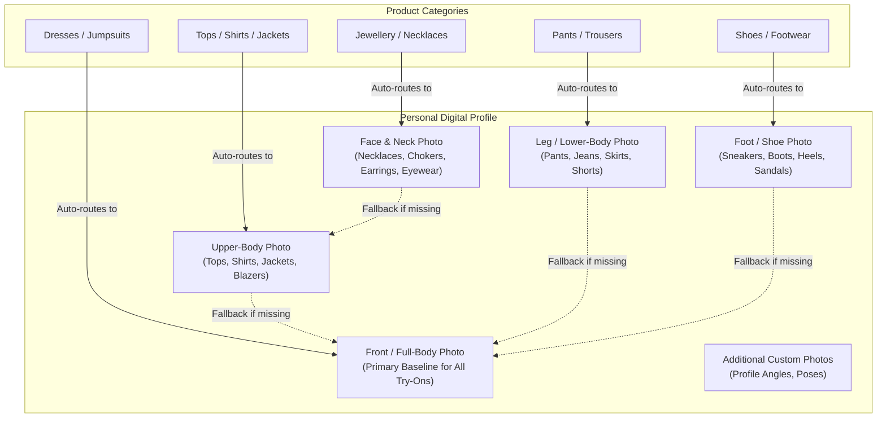

# Personal Digital Profile System

**Document Version:** 1.0.0  
**Status:** Approved Architecture Baseline  
**Classification:** Core Functional Specification  

---

## 1. Overview & Reusability Mandate

In direct adherence to Assignment Section 3 and Section 15, the **Personal Digital Profile** is engineered as a persistent, reusable asset:
- The user creates and uploads their profile photographs **once**.
- When browsing subsequent shopping websites and trying on dozens of products, the user **never needs to re-upload photos**.
- The platform dynamically maps the selected product's category to the optimal photograph view within the active profile.

---

## 2. Supported Photograph Types & Specifications

### Technical Photo Specifications
| Photo Type Code | Primary Categories | Minimum Dimensions | Recommended Ratio | Key Framing Requirements |
|---|---|---|---|---|
| `FRONT_FULL_BODY` | Dresses, Outerwear, Fallback for all | $768 \times 1024\text{ px}$ | 3:4 or 9:16 | Full head-to-toe framing; arms slightly apart from torso; straight-on camera at waist height. |
| `UPPER_BODY` | T-shirts, Shirts, Jackets | $768 \times 1024\text{ px}$ | 3:4 | Head to hip framing; clear collarbone and shoulder line; arms relaxed at sides. |
| `LOWER_BODY` | Pants, Jeans, Trousers | $768 \times 1024\text{ px}$ | 3:4 or 9:16 | Waist to floor framing; standing straight with feet shoulder-width apart. |
| `FEET` | Shoes, Sneakers, Boots | $600 \times 600\text{ px}$ | 1:1 or 4:3 | Clear top-down or 45-degree angle of feet; ankle visible. |
| `FACE` | Necklaces, Jewellery | $600 \times 600\text{ px}$ | 1:1 | Chin, neck, and upper chest clearly visible; hair tucked behind shoulders. |

---

## 3. Photograph Capture & Onboarding Guidance

To guarantee optimal AI synthesis fidelity (avoiding warped limbs or distorted garment textures), the extension profile creation interface presents interactive, visual capture instructions:

1. **Lighting & Clarity:**
   - Shoot in bright, diffuse daylight or well-lit indoor rooms.
   - Avoid harsh backlighting (e.g. standing directly in front of a sunlit window) which creates silhouettes.
   - Avoid heavy filters, extreme grain, or camera motion blur.
2. **Background & Environment:**
   - Stand against a plain, neutral wall (white, light grey, or beige).
   - Minimize visual clutter (no furniture, doorway edges, or other people in frame).
3. **Posing & Posture:**
   - Stand in a natural, neutral upright posture looking directly at the camera.
   - Keep hands and arms slightly separated from the waist so body contours are distinct.
4. **Apparel Considerations:**
   - Wear neutral, form-fitting attire (e.g. plain t-shirt and fitted jeans or leggings).
   - Avoid bulky coats, baggy hoodies, or heavy patterns during base photo capture, as these impede realistic inpainting of new garments.
5. **Camera Position & Framing:**
   - Hold camera at mid-torso / eye level (avoid extreme high-angle or low-angle fish-eye selfies).

---

## 4. Privacy, Security & Data Management

- **Storage Location:** All profile images are encrypted at rest and stored exclusively in a private S3 bucket (`profiles/{userId}/{profileId}/{photoId}.webp`).
- **Zero Public Exposure:** Images are never accessible via public URLs; the extension retrieves them only through temporary pre-signed URLs (15-minute expiration) generated on demand.
- **Client-Side Preprocessing:** Profile images are converted to WebP and downscaled to a max dimension of $1536\text{px}$ on the client before upload, saving bandwidth and reducing backend processing overhead.
- **One-Click Deletion:** Users can delete individual photos or purge their entire digital profile at any time, which permanently removes all database records and storage blobs.
- **Strict Non-Training Guarantee:** The onboarding flow requires an explicit opt-in checkbox confirming that personal photos are used strictly for real-time try-on generation and are never used to train public models.
