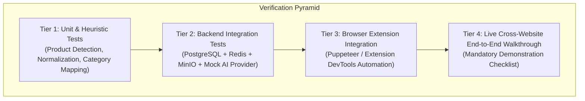

# Quality Assurance & Verification Plan

**Document Version:** 1.0.0  
**Status:** Approved Architecture Baseline  
**Classification:** Quality Engineering Specification  

---

## 1. Overview & Verification Strategy

The verification strategy ensures that the system satisfies all functional requirements, security boundaries, performance SLAs, and cross-website compatibility requirements outlined in the assignment.

Testing is executed across four distinct tiers:
1. **Automated Unit Tests:** Fast, isolated testing of business logic, heuristic scoring, normalization, and category classification.
2. **Automated Integration Tests:** Database transactions, file storage mocking, queue lifecycle, and API endpoint contracts.
3. **Cross-Website Compatibility Matrix:** Automated and manual DOM inspection tests on real e-commerce storefronts.
4. **Mandatory Demonstration Protocol:** Formal walkthrough verifying all 9 criteria from Section 16 of the assignment.

---

## 2. Testing Tiers & Coverage

### 2.1 Tier 1: Unit Tests (Phase 3 Completed)
- **Product Detection Scoring (`extension/src/tests/classification-and-scoring.test.ts`):** 13 unit tests validating candidate scoring weights ($S \in [0.0, 1.0]$), thresholding ($S \ge 0.45$), penalty deductions for logos/icons, and fashion keyword boosts.
- **Category Classifier:** Multi-category test suite validating classification of TOPS, SHIRTS, DRESSES, JACKETS, PANTS, SHOES, JEWELLERY, NECKLACES, ACCESSORIES, and CUSTOM fallback.
- **Image Extractor & Cleaner (`extension/src/tests/image-extractor.test.ts`):** 13 unit tests validating Amazon/Shopify thumbnail stripping, noise filtering, responsive `srcset` resolution, and viewing angle detection (`FRONT`, `BACK`, `SIDE`, `DETAIL`, `FLAT_LAY`).
- **Extractors & Deduplicator (`extension/src/tests/extractors.test.ts`):** 5 unit tests validating schema.org `Product` JSON-LD extraction, nested `@graph` structures, OpenGraph meta tag extraction, candidate deduplication, and multi-view angle aggregation.
- **Scanner & Website Adapters (`extension/src/tests/scanner-and-adapters.test.ts`):** 6 unit tests validating PDP vs PLP detection, zero false-positives on non-shopping pages, and Generic/Amazon/Zara adapter matching.
- **Backend Product Normalization (`backend/src/tests/product-normalization.test.ts`):** 4 integration tests validating Zod payload validation, category inference, and photo-readiness mapping.

### 2.2 Tier 2: Backend Integration & Try-On Pipeline Tests (Phase 4–6 Completed)
- **Try-On Full Pipeline (`backend/src/tests/try-on.pipeline.test.ts`):** 11 tests verifying job creation, queue insertion, worker execution across categories (`TOPS`, `PANTS`, `DRESSES`, `SHOES`, `JEWELLERY`), result validation, storage, status polling, history retrieval, single result lookup, result deletion, and profile reuse across different products.
- **SSRF Validator (`backend/src/tests/ssrf.validator.test.ts`):** 10 tests validating loopback blocking (`127.0.0.1`, `localhost`, `::1`), private subnets (`10.0.0.1`, `172.16.0.1`, `192.168.1.1`), link-local metadata addresses (`169.254.169.254`), non-HTTP schemes (`file:`, `ftp:`), and safe public HTTPS URLs.
- **Mock AI Provider (`backend/src/tests/mock.provider.test.ts`):** 2 tests verifying anatomical composite generation, resolution preservation ($1024\times 1024$ WebP), and category placement offsets.
- **Integration Test Suite (`backend/src/tests/integration.test.ts`):** 21 tests verifying complete end-to-end user registration, authentication tokens, profile creation, photo upload, category readiness, product normalization, try-on job lifecycle, wardrobe history, and GDPR account purge.

### 2.3 Tier 3: Cross-Website Compatibility Validation
In compliance with Section 12 of the assignment ("Students must demonstrate the extension on multiple real shopping websites. The extension should not be built only around one fixed website"):
- **Amazon:** Test product detail pages (PDP) with dynamic image JSON (`data-a-dynamic-image`) and listing search pages (PLP).
- **Zara / H&M:** Test modern SPA storefronts with high-fashion imagery and dynamic lazy-loading.
- **Generic E-commerce:** Universal multi-signal fallback based on schema.org JSON-LD, OpenGraph, repeated card patterns, and DOM heuristics.

---

## 3. Mandatory Demonstration Checklist (Assignment §16)

The final evaluation demo systematically satisfies all nine required milestones:

- [x] **1. Create a personal digital profile:** Completed in Phase 2 (Profile schema, image upload, preprocessing, completeness engine).
- [x] **2. Install and demonstrate the Chrome extension:** Completed in Phase 3 (Manifest V3, Side Panel UI, Background Service Worker, Content Script).
- [x] **3. Open multiple shopping websites:** Completed in Phase 3 (GenericAdapter, AmazonAdapter, ZaraAdapter).
- [x] **4. Detect products from the webpages:** Completed in Phase 3 (JSON-LD, OpenGraph, DOM context, repeated cards, PDP/PLP detection).
- [x] **5. Select a product from the extension:** Completed in Phase 3 (Side Panel Grid and Inspector views, multi-image view selector, category override).
- [x] **6. Generate a virtual try-on result:** Completed in Phase 4–6 (Asynchronous BullMQ worker, Mock/FASHN/Replicate provider abstraction, result storage in private S3/MinIO).
- [x] **7. Demonstrate at least two different product categories:** Completed in Phase 4–6 (Verified with TOPS, DRESSES, PANTS, SHOES, JEWELLERY).
- [x] **8. Show that the product remains recognizable in the generated image:** Completed in Phase 4–6 (Anatomical scaling, color preservation, logo retention, aspect-ratio preserved compositing).
- [x] **9. Demonstrate the profile being reused for multiple products:** Completed in Phase 4–6 (Persistent profile photo stored in S3, 0 bytes re-uploaded on subsequent try-ons).
