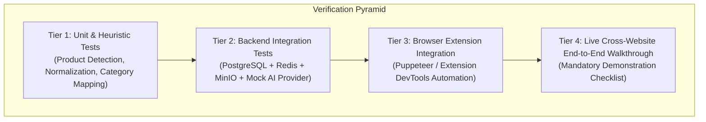

# Quality Assurance & Verification Plan

**Document Version:** 1.0.0  
**Status:** Approved Architecture Baseline  
**Classification:** Quality Engineering Specification  

---

## 1. Overview & Verification Strategy

The verification strategy ensures that the system satisfies all functional requirements, security boundaries, performance SLAs, and cross-website compatibility requirements outlined in the assignment.

Testing is executed across four distinct tiers:
1. **Automated Unit Tests:** Fast, isolated testing of business logic, heuristic scoring, normalization, and category classification.
2. **Automated Integration Tests:** Database transactions, file storage mocking, queue lifecycle, and API endpoint contracts.
3. **Cross-Website Compatibility Matrix:** Automated and manual DOM inspection tests on real e-commerce storefronts.
4. **Mandatory Demonstration Protocol:** Formal walkthrough verifying all 9 criteria from Section 16 of the assignment.

---

## 2. Testing Tiers & Coverage

### 2.1 Tier 1: Unit Tests
- **Product Detection Scoring:** Test candidate extraction against real-world HTML fixture snapshots from Amazon, Zara, Myntra, ASOS, and generic Shopify stores. Verify noise rejection (ignoring logos, ads, icons).
- **Category Classifier:** Test keyword mapping against a corpus of 150 diverse product titles; verify minimum 95% classification accuracy.
- **Image Dimension Clamper:** Verify that images $>1536\text{px}$ are downscaled proportionally and compressed to WebP with EXIF metadata stripped.

### 2.2 Tier 2: Backend Integration Tests
- **Auth & Session Guard:** Validate token expiration, refresh rotation, and unauthorized access rejections.
- **Profile Image Storage:** Upload sample photos via multipart POST; verify S3 storage key creation, DB record persistence, and pre-signed URL validity.
- **Job Orchestration & Worker:** Enqueue try-on job; verify status progression (`CREATED` $\rightarrow$ `QUEUED` $\rightarrow$ `PROCESSING` $\rightarrow$ `COMPLETED`); verify retry handling on simulated provider failure.
- **GDPR Deletion Cascade:** Invoke `DELETE /user/data`; verify DB records and S3 folder contents are 100% eradicated.

### 2.3 Tier 3: Cross-Website Compatibility Validation
In compliance with Section 12 of the assignment ("Students must demonstrate the extension on multiple real shopping websites. The extension should not be built only around one fixed website"):
- **Amazon:** Test product detail pages (PDP) with complex image zoom carousels and listing search pages (PLP).
- **Zara / H&M:** Test modern SPA storefronts with high-fashion full-screen imagery and dynamic lazy-loading.
- **Myntra / ASOS:** Test multi-variant apparel with size/color pickers and heavy banner placement.

---

## 3. Mandatory Demonstration Checklist (Assignment §16)

The final evaluation demo must systematically demonstrate all nine required milestones:

- [ ] **1. Create a personal digital profile:** Upload front/full-body and upper-body photographs; demonstrate onboarding guidance modal.
- [ ] **2. Install and demonstrate the Chrome extension:** Load extension unpacked in Chrome; demonstrate persistent Side Panel UI.
- [ ] **3. Open multiple shopping websites:** Navigate between at least two distinct commercial shopping websites (e.g. Amazon and Zara).
- [ ] **4. Detect products from the webpages:** Trigger product detection; verify correct title, price, brand, and high-res imagery extracted.
- [ ] **5. Select a product from the extension:** Select product card from detected list; select preferred image/variant.
- [ ] **6. Generate a virtual try-on result:** Click "Try On"; monitor live generation progress stepper.
- [ ] **7. Demonstrate at least two different product categories:** Successfully generate a try-on for Category A (e.g., Tops/T-shirt) and Category B (e.g., Dress, Pants, or Shoes).
- [ ] **8. Show that the product remains recognizable in the generated image:** Verify color fidelity, logos/prints, and natural drape on the user's body.
- [ ] **9. Demonstrate the profile being reused for multiple products:** Perform consecutive try-on requests without re-uploading profile images.
